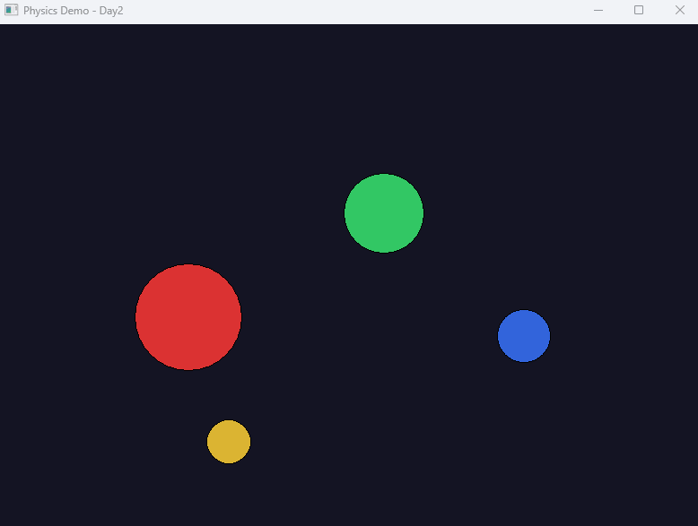

# Physics Demo

> C++ / Windows API로 구현한 2D 물리 시뮬레이션

## 개요

GPU나 물리 엔진 라이브러리 없이 CPU만으로 2D 물리 시뮬레이션을 직접 구현한 프로젝트입니다.
충돌 감지, 충돌 반응, 중력, 마찰력 등 물리 엔진의 핵심 요소를 수학적으로 직접 구현했습니다.

## 구현 기능

| 기능 | 설명 |
|------|------|
| 원형 렌더링 | Windows GDI Ellipse로 다양한 크기의 원 렌더링 |
| 중력 | 매 프레임 vy에 중력 가속도 누적 |
| 벽 충돌 | 클라이언트 영역 기준 경계 충돌 감지 및 반응 |
| 에너지 감쇠 | 충돌 시 속도 85% 유지 → 자연스러운 에너지 손실 |
| 바닥 마찰력 | 바닥 충돌 시 수평 속도 감소 |
| 원형 충돌 감지 | 두 원의 거리와 반지름 합 비교 |
| 충돌 반응 | 충돌 법선 벡터 기반 속도 분리 + 겹침 해소 |
| 충돌 시 색상 변경 | 충돌 시 랜덤 색상으로 변경 |

## 물리 구현 원리

**충돌 감지:**

dist = sqrt((x2-x1)² + (y2-y1)²)
충돌 = dist < r1 + r2

**충돌 반응 (법선 벡터 기반):**

충돌 법선 n = (dx, dy) / dist
상대 속도 dot = (v1 - v2) · n
v1 -= dot * n
v2 += dot * n

**겹침 해소:**

overlap = (r1 + r2 - dist) / 2
각 공을 overlap만큼 반대 방향으로 밀어냄

## 빌드 환경

- Visual Studio 2022
- C++17
- Windows API (Win32 / GDI)

## 빌드 방법

1. `PhysicsDemo.sln` 열기
2. 구성: `Release / x64`
3. 빌드 실행